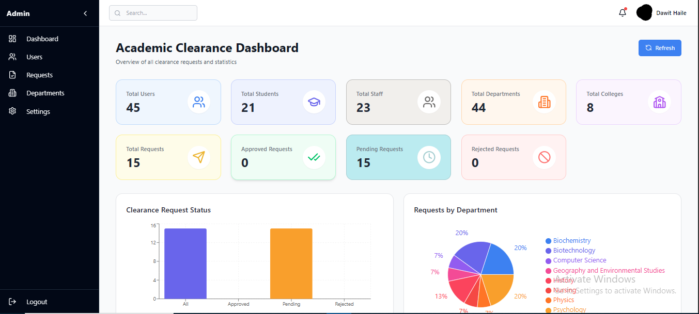
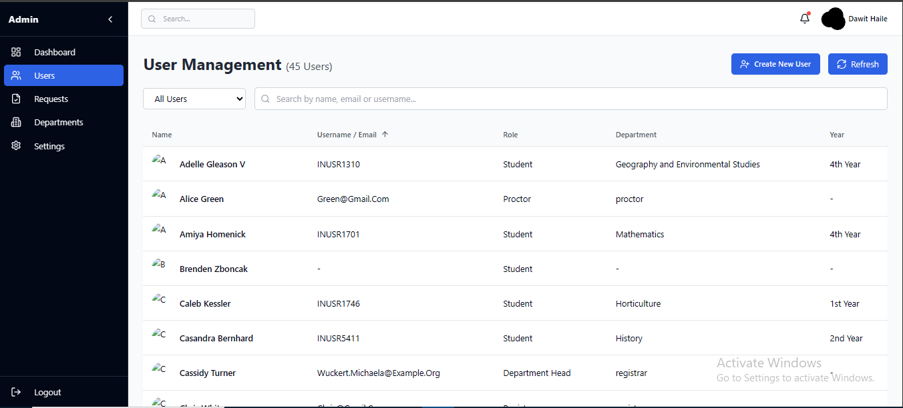
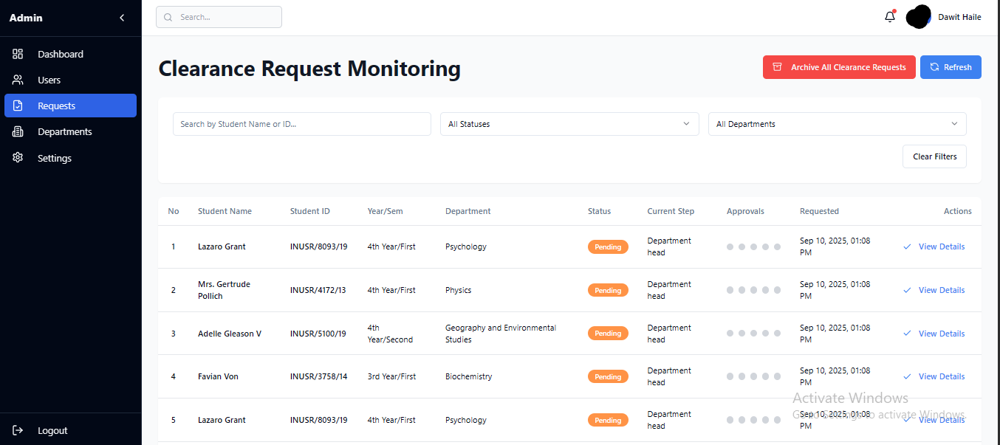
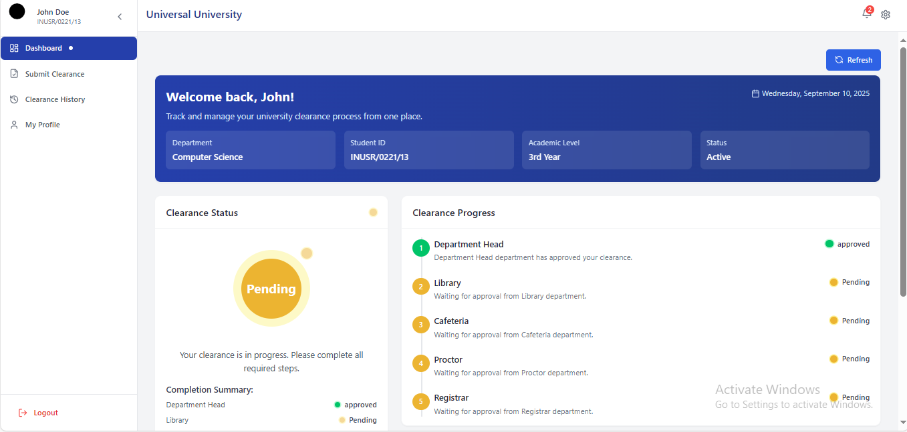
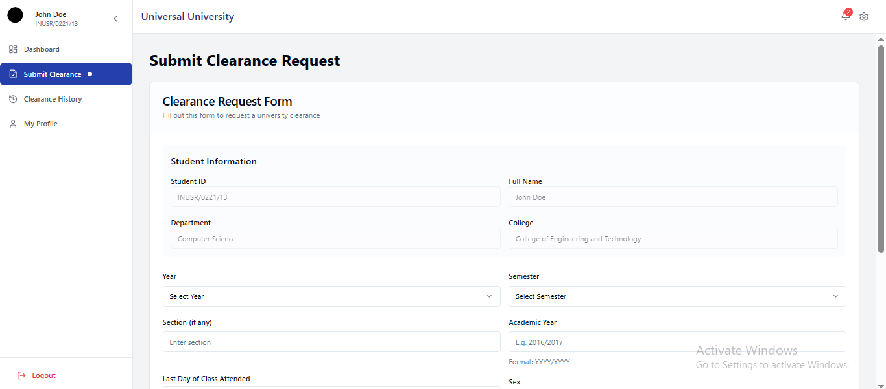

# 🎓 University Clearance Management System

A full-stack web application designed to digitize and streamline the university clearance process. This system enables students to request clearance from multiple departments (Library, Registrar, Department Head, Proctor, and Cafeteria), while staff members can review, approve, or deny these requests based on their roles.

---

## 🚀 Features

- 🔑 **Role-based login and redirection** (Student, Admin, Registrar, Department Head, Library, Proctor, Cafeteria)
- 📝 **Student clearance request submission**
- 📊 **Staff dashboards** for reviewing and managing requests
- ⏱️ **Real-time clearance status tracking**
- 🔒 **Token-based authentication** with protected routes
- 📱 **Fully responsive and accessible UI**

---

## 🛠️ Tech Stack

### Frontend

- ⚛️ **React (TypeScript)**
- 🎨 **Tailwind CSS**
- ⚡ **Vite** (fast development build tool)
- 🧩 **Shadcn/ui** (modern UI components)

### Backend

- 🐘 **Laravel 11**
- 🗄️ **PostgreSQL** (database)
- 🔗 **Axios** (API communication)

---

## 🔐 Roles & Permissions

- **Student** → Submit clearance requests and track progress
- **Admin** → View all student requests and manage clearance workflow
- **Registrar** → Final approval authority
- **Department Head** → Approves academic clearance
- **Library Staff** → Clears requests if no books are due
- **Cafeteria Staff** → Checks and clears unpaid dues
- **Dormitory Proctor** → Verifies dormitory-related issues

---

## 📷 Landing Page Overview

- **Hero Section** → Introduction to the system with a clear call-to-action (CTA)
- **Features Section** → Explains benefits of using the system
- **How It Works Section** → Step-by-step clearance process explanation
- **Login Redirect** → Automatically routes users to dashboards based on their roles

---

## 📦 Installation Guide

Follow these steps to set up the project locally:

### 1. Clone the Repository

```bash
git clone https://github.com/YourUsername/University-clearance-system.git
cd University-clearance-system
```

### 2. Setup the Frontend (React + Vite)

Open a new terminal and run:

```bash
cd front
npm install
npm run dev
```

👉 The frontend will be available at: `http://localhost:5173`

### 3. Setup the Backend (Laravel 11 + PostgreSQL)

In another separate terminal, run:

```bash
cd back
composer install
```

Copy environment file and configure database:

```bash
cp .env.example .env
```

Edit `.env` and update these lines with your PostgreSQL credentials:

```env
DB_CONNECTION=pgsql
DB_HOST=127.0.0.1
DB_PORT=5432
DB_DATABASE=clearance_db
DB_USERNAME=your_pg_username
DB_PASSWORD=your_pg_password
```

Then run the following commands:

```bash
# Generate application key
php artisan key:generate

# Run migrations
php artisan migrate

# Seed database with sample data (optional)
php artisan db:seed

# Start backend server
php artisan serve
```

👉 The backend will be available at: `http://localhost:8000`
👉 The frontend will be available at: `http://localhost:5173`

# Login as Admin using

username "admin@university.com"
password "adminpass"

# Create any user by going to the Users tab

✅ Quick Test
Run both frontend and backend servers.

Open the frontend in your browser → http://localhost:5173

Login with a test user (from seeded database if available).

Explore role-based dashboards:

# Landing Page


# Admin Dashboard





# Student Dashboard




# Department Head Panel


Registrar Panel

Library Panel

Proctor Panel

Cafeteria Panel

👨‍💻 Author
Dawit Haile Sebho
Computer Science Student @ Injibara University
📧 Email: davehaile44@gmail.com
🌐 GitHub: Dave-haile

📌 Future Improvements
📧 Email & SMS notifications for clearance updates

📜 Activity logs for staff actions

📄 Export clearance certificates as PDF

🌍 Multilingual support (Amharic & English)

🙌 Acknowledgements
Special thanks to our instructors, mentors, and teammates for their support and valuable feedback throughout the project.

---

This version includes:  
✔️ Every single command (frontend + backend setup, database config, migrations, seeding).  
✔️ Clear instructions on what URL to open for both frontend & backend.  
✔️ PostgreSQL `.env` example filled out.  
✔️ Professional formatting and emojis for readability.
